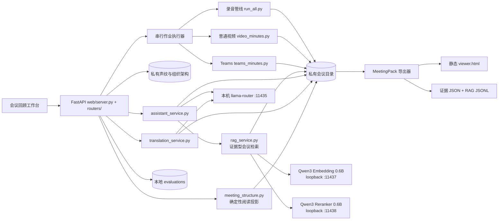

# 系统架构

## 目标与边界

本项目把本地录音、普通录屏和 Teams 录制转换为可检索逐字稿、说话人信息、幻灯片页和会议纪要。默认情况下，会议正文、录音、声纹和组织架构不离开本机。

不在当前范围内：多人账号、远程部署、公网访问、云端模型自动回退、跨会议全局语义搜索。

## 组件关系

## 目录职责

| 目录 | 职责 | Git |
|---|---|---|
| `bin/` | ASR、分离、抽页、纪要、声纹等批处理脚本 | 跟踪 |
| `web/` | FastAPI 服务、无构建前端、隔离测试 | 跟踪 |
| `docs/`、`prompts/` | 架构、运维、模型与提示词规范 | 跟踪 |
| `recordings/` | 原始输入与上传 inbox | 永不跟踪 |
| `meetings/` | 每场会议的全部派生文件和本地历史版本 | 永不跟踪 |
| `speaker_bank/` | 声纹、人员、组织架构与参考材料 | 仅跟踪虚构模板 |
| `evaluations/` | 人工验收事件、claim 指纹和标签；不复制会议正文 | 永不跟踪 |
| `web/jobs/` | 本地作业状态 JSON | 仅跟踪 `.gitkeep` |

代码根固定为仓库目录；数据根默认与代码根相同，也可通过 `MEETING_DATA_ROOT` 指到独立磁盘或一次性测试目录。管线脚本始终来自代码根，会议、上传和声纹数据来自数据根。

## 数据流

### 录音

`run_all.py` 先把输入固化为会议目录内的 `audio.wav`，再并行执行 ASR 与说话人分离，随后合并轮次并调用本机文本模型生成纪要。

### 普通录屏

`video_minutes.py` 抽取音轨，并行执行 ASR/分离，随后入库匿名声纹（入库收尾时 ≤2 轮未绑定碎片声纹以 0.80 高阈值再匹配并入）。逐字稿和说话人稳定后先用文本模型发布语音草稿；之后抽取逻辑页、进行 VL 页面理解（`describe_pages` 为有界并发，`MEETING_VL_WORKERS` 默认 2，需与 VL 服务 `--parallel` 槽位匹配；每页完成即原子落缓存，中断续跑语义不变），再用按页纪要原位替换草稿。

### Teams 录制

`teams_minutes.py` 使用 VTT 的姓名线索与本地分离结果对齐；会议室混合通道继续按声纹拆分，然后进入同样的语音草稿 → VL 终稿流程。

音视频导入后通过 `meeting_dir.materialize_source` 固化到会议目录。优先创建独立 inode 的 CoW reflink，不支持时完整复制；`source.json` 的主媒体路径指向会议内文件。Web 对旧会议继续支持外部 `source.json` 回退，避免迁移前录音因缺少 `audio.wav` 而无法播放。

### 纪要证据与导出

`meeting_generation.py` 管理 `meeting-generation/v1` sidecar，只保存阶段、revision 和统计，不复制正文。阶段为 `voice_draft_generating → voice_draft → visual_enrichment → ready`。语音草稿请求显式关闭模型 thinking，避免输出预算全部落入隐藏 reasoning 而没有可读正文；失败时记录受控 `voice_draft_rc`，不阻断 VL 终稿，但前端必须明确显示“草稿失败，正在生成终稿”，不能把空纪要误报成草稿可读。语音草稿另存 `minutes.voice-draft.*` 作为可回溯快照；前端检测可读日志后立即打开，终稿 revision 变化时按同名标题尽量恢复阅读位置。草稿可播放、搜索、翻译和追问；服务端同时拒绝编辑应用、结论审计写入、Topic Map、重生成和 MeetingPack 导出。

文本模型协议由不依赖 Web 的 `meeting_core.llm` 统一处理，包括 loopback 边界、模型选择、thinking、超时和安全错误分类；`meeting_core.context_budget` 负责实际上下文窗口与保守 token 预算。`meeting_core.voice_draft` 在完整提示可容纳时直接生成；超限时按连续 T ID 轮次切成受预算约束的片段，先提取事实笔记，再合并为常规纪要。分段笔记是临时推导，不替代 canonical 逐字稿，最终 evidence 仍只能引用原始 T ID。后续 Topic Map、翻译、助手和终稿调用应逐步迁移到同一客户端，避免各自维护协议参数。

`minutes_by_page.py` 和 `summarize.py` 使用 `meeting-minutes-prompt/v1` 结构化输入，并在可读 Markdown 中留下隐藏的 T/P 证据 marker。`meeting_artifact.py` 将其规范化为 `minutes.evidence.json`；Web、`export_meeting.py` 和后续 RAG 都消费同一 sidecar。导出器生成 `meetingpack/v5`：顶层只有 `viewer.html + README.txt + AGENTS.md + assets/`（AGENTS.md 是给 AI agent 的文件地图与引用规则，整包拖进 agent 会话时不只读纪要），完整逐字稿、Topic Map、屏幕资料、媒体时间跳转、证据状态及已生成的双语纪要进入同一个无需服务、LLM、CDN 或网络请求的 Viewer。Viewer 只保留与在线工作台一致的“会议脉络 / 会议纪要 / 屏幕内容”，不再导出四种 audience/depth 重排视图。VL 描述在进入 evidence、Viewer 和 RAG 前复用在线端的 reasoning 清洗/标题提取。导出只生成长边 1600px WebP 与压缩分享媒体，不反写 canonical sidecar 或原始母版。完整规范见 `docs/EXPORT_AND_RAG.md`。

多模态终稿的总体部分同样受 `ContextBudget` 约束。短会议直接生成；超限会议由 `meeting_core.minutes_overview` 按连续 T ID 切片，每段只携带关联 P 页面，再用人员语境和全页目录归并为总体摘要、行动、风险及 3–8 个议题板块。map/reduce 输出带退化防护：检测到自我修正循环或同一长句反复重述时，以 `repeat_penalty=1.2` 完整重试一次，仍退化则确定性清理（重复长行留首现、自我修正链整行删）后继续，不把循环垃圾写进 `minutes.md`；reduce 缺“总体摘要/待办事项”章节同样触发重试。待办章节另有合规校验：有表格行就必须逐行带 `kind=action`+`turns=` 证据标记，不合规先随防护重试，仍不合规按片段事实笔记定点重写该章节（`REPAIR_TODO_PROMPT`）并拼接回终稿。逐页讨论块继续按页面分组生成并独立控制输入规模。Web 重生成复用现有逐字稿、逻辑页和有效 VL 缓存，有源视频时只重抓缺页；成功后通过 `--publish` 更新 ready 状态并刷新 Topic Map。

若服务在 `visual_enrichment` 阶段中断，旧作业在重启时先标记失败；只要不存在同会议活动 writer，且 transcript/slides 仍完整，`regen_minutes` 可作为阶段级续跑入口，复用已完成的 VL cache，仅补缺页并发布终稿。其他草稿阶段仍拒绝重生成，避免 revision 竞态。

### 媒体固化与存储生命周期

`meeting_dir.materialize_source()` 优先使用 Btrfs/兼容文件系统的 CoW reflink：会议母版拥有独立 inode，初始共享数据块，因此删除或原地修改下载源都不会影响项目文件，也不会立刻复制一份完整大文件；reflink 不可用时退回 `copy2`。浏览器上传先写项目 inbox，管线成功并确认母版已经固化后自动删除 inbox；失败或取消则保留，以便诊断和重试。音频导入同时保存 `source_audio.<ext>` 母版和可再生的 16k PCM 工作音轨。

`meeting-storage/v1` 把每场会议分为三类：原始母版（受保护）、阅读资产（逐字稿、纪要、证据、Topic Map、逻辑页面等）和可再生缓存（PCM 工作音轨、`full_*` VL 工作帧、`.rag` 索引）。分类和清理集中在独立的 `web/storage_service.py`；每个候选文件除白名单外还必须解析到会议目录内，符号链接目录既不计入缓存也不跟随。`POST /storage/cleanup` 只删除代码白名单内且具备再生来源的缓存，并在会议仍有作业时拒绝执行；它永不删除母版或阅读资产。接口显示的是逻辑大小，CoW 共享块使实际物理释放量可能更低。当前清理由用户显式触发，自动保留期需在具备策略开关和磁盘压力提示后再启用。

### 人工结论审计

`evaluation_service.py` 将当前 evidence claim 与本机追加式审计事件合并。事件只落 claim ID、标签、备注和来源结构指纹；指纹在内存中覆盖结论及其引用的逐字稿/页面内容，但不把来源正文复制到评测文件。浏览器提交 claim 指纹作为乐观锁，服务端重新计算后才接受写入。相关来源发生变化时只让对应判断失效，审计动作不会修改 `minutes.md`。删除会议时同步删除该会议的审计文件。

### 上下文感知翻译

`translation_service.py` 读取原始逐字稿，按目标语言分别生成 `transcript.translation.zh-CN.json` 和 `transcript.translation.en.json`。翻译按连续十轮分批，每批附带前后两轮、已确认人员名称、当前页面和直接关联的 evidence claims；系统提示将 conclusions 定义为低信任消歧材料，禁止补入当前发言未表达的事实。已经是目标语言的轮次由代码直接复用，其他语言及中英混合轮次调用与会议助手相同的本机 LLM，并整体整理成目标语言。批次顺序可在运行中由纪要依据和当前播放位置调整，但每批使用的原始语境不变。

会议脉络使用 `meeting.topic-map.translation.{target}.json` 保存结构化译文。模型只返回 `meeting_summary`、topic/child 的 `title` 与 `summary`；服务端按 ID 校验同构后，把 canonical 的节点 ID、类型、ranges、turn/claim/page IDs 覆盖回译文，避免语言切换破坏时间跳转或审计 linkage。sidecar 绑定 `meeting.topic-map.json` revision，旧译文不会跨版本展示。

同一服务按需生成 `minutes.translation.zh-CN.json` / `minutes.translation.en.json`。纪要按 Markdown 块切片；隐藏 evidence marker 在发送模型前替换为确定性 token，返回后逐一校验并恢复，因此译文继续指向同一组 claim/T/P 证据。sidecar 同时绑定 canonical 纪要 revision 和会议语境 revision，不覆盖 `minutes.md`；原文已经是目标语言时直接返回，不创建冗余文件。

sidecar 保存 T ID、源语言、译文、数字核对警告、逐字稿 revision 和会议语境 revision，不修改原始转写。翻译通过串行 Web 作业运行并逐批原子落盘；前端轮询部分 sidecar，只在完整轮次落盘后更新。取消、失败和服务重启保留已完成轮次并以显式 partial 状态续跑，不会产生一份伪装成完整结果的译文。当前为整场缓存与整场语境失效，后续如引入逐字稿局部修订，再细化为按 T ID 选择性重译。

### 在线阅读结构投影

`meeting_structure.py` 在请求 bundle 时读取现有纪要议题、`slides.json`、`page_desc.json`、逐字稿和 evidence，生成 `meeting-structure/v2`。它不调用模型、不写会议文件，只提供三个稳定对象：

- `Segment`：一个逻辑页面或摄像头画面的一次连续出现。同一页面的多个 range 必须展开成多个 Segment，避免返回旧页时所有跳转都落到第一次；
- `Chapter`：一个连续讨论时间段。优先解析纪要“议题板块”的开始时间，缺失时按视觉 Segment 降级；章节关联 T/P 来源，并确定性分组 discussion/decision/action/open claim；
- `Visual`：逻辑页面级资料，一页只保存一份完整 VL 描述和图片，同时列出全部出现 ranges、相关 Segment 与 claim。`display_status` 区分被讨论、仅展示和摄像头动态画面；`content_role` 与 `information_value=high|medium|low` 标记页面角色和信息价值。新 VL 输出显式给出这两个字段，旧缓存使用保守启发式；空白、过渡、会议 UI 等低信息 Segment 不再单独创建 fallback Chapter。

`information_value` 另有 `unknown` 状态：页面尚未处理、模型正文为空或 reasoning 清洗后无可靠答案时只能标“待解析”，不得用描述字数推断为低价值。只有 VL 明确给出 low，或页面说明明确命中空白、过渡、会议 UI 等语义时才能降为 low；简短但有效的旧说明默认保留为 medium。`describe_pages()` 在详细解读为空时改用短 JSON 视觉读取提取标题、页面类型和摘要，再确定性转成页面说明；两条路径都失败才保留 unknown，空正文不持久化为成功缓存。页面价值与 `display_status` 的讨论关联度始终是两条独立维度。

`meeting_topic_map.py` 在纪要生成完成后使用本机 LLM 建立 `meeting-topic-map/v2` sidecar（revision 匹配的 v1 旧图仍判 ready）。它先把逐字稿按约十五分钟窗口做局部候选归纳，再把整场候选与 canonical claims 归并成 3–8 个一级 Topic 和类型化子节点。每个节点必须绑定有效 T/P/C ID；未知 ID 和无来源节点在代码层丢弃。相同 Topic 的非连续证据范围会保留在一个节点中。局部归纳要求全场覆盖：每个轮次归入候选或显式列入 `uncovered_turn_ids`，归并后仍未挂接的轮次由代码按时间邻接确定性归入最近议题（只扩展 ranges/turn_ids，不改写模型文本），并允许一个带 `low_value` 标记的“过渡与杂项”议题；`stats.coverage` 记录覆盖率。局部 map 和全局 reduce 返回不合法 JSON 时，只允许模型修复标点、引号与括号，不能重新归纳字段或来源 ID；修复仍失败的单窗降级为空归纳交兜底分配，归并修复失败完整重试一次。成功的局部窗口原子写入 checkpoint。sidecar 绑定逐字稿、纪要、页面和 VL revision，输入变化即标记 stale，旧节点不向前端暴露。

前端时间线用 Topic 的一个或多个 ranges 作为上层、Segment 作为下层；右侧“会议脉络”展示“整场会议—一级议题—背景/观点/约束/决定/行动/风险/待确认”的思维导图。通过质量门槛（`ready` 且 3–8 个一级议题）的 Topic Map 是 Web 与 MeetingPack 的默认首屏；首屏只画根节点与一级议题，选择某一分支后才展开其子节点。节点点击建立共享语义 Focus，但不改变播放时间；时间轴、逐字稿时间码和显式范围按钮负责 seek，并联动当前屏幕、逐字稿和结论高亮。Topic 和屏幕页面都只是 canonical evidence 的索引与重组；点击结论仍进入统一证据栏，VL 描述不能单独证明会议决定。Topic Map 缺失或不合格时回退正式会议纪要，不把视觉 Segment 扩写成几十个假章节。

`slide_pages.py` 的变化检测默认排除画面右侧 15% 的会议 UI/参会人栏，再计算时序活动掩码、页面相似度和代表帧。用于判页的低分辨率 RGB 帧会先抑制稀疏的高饱和红框/激光点；页面距离同时比较全页稳定内容和顶部 22% 标题区，所以同一表格的局部标注不切页，大标题改变仍切页。RGB 逐帧流式转灰度，不使整段三通道帧常驻内存。输出截图仍从原视频抓取完整画面；参数 `--ignore-right-pct 0` 可关闭右栏排除。

Web 与 MeetingPack 的常规纪要通过 `minutes_reading_markdown()` 从 canonical Markdown 做只读投影，在第一个“分页详情/逐页详情”章节前截断。投影层会从 claims 重新计算 `formal_action`，再重建“可核验待办”表：只有来自整场“待办事项/Action Items”章节、带有效逐字稿 T ID、且状态不是 informational 的行动项进入正式表格。逐页详情里被模型误标成 action 的设备调试、到会确认、议程和汇报事实仍保留为 claim，但不进入待办统计、行动 RAG 加权或章节行动组。旧 sidecar 也在读取时重投影，不要求重跑模型。原模型待办表中没有绑定来源的行不会删除，而是进入 `action_candidates`，由在线端和离线 Viewer 默认收起并标为“待核实候选”；它们不能用于正式任务统计，后续可通过证据绑定晋级。模型生成的“议题板块”不再重复出现在常规纪要，其整场结构由带 T/P/C linkage 的独立 Topic Map 负责。原始 `minutes.md` 不被改写，逐页事实和旧模型文本继续进入 evidence、Visual 和 RAG，便于审计与再处理。MeetingPack 的 `assets/minutes.md` 是同一常规阅读投影，机器侧完整事实以 `assets/evidence.json` 和 `assets/rag/records.jsonl` 为准。

所有模型文本进入阅读结构前统一剥离完整、残缺或反向出现的 `<think>/<analysis>` 块。新纪要/VL 生成同样在落盘前清洗；如果旧 VL 缓存清洗后没有可靠答案，页面标为需要重新解析，不把推理过程伪装成标题。

## Web 作业模型

- GPU/重模型管线统一进入单 worker `SerialPriorityExecutor`，避免互相争抢模型资源，同时允许尚未开始的任务重排。默认顺序为“用户置顶 > 新会议处理 > 纪要/脉络/组织图 > 逐字稿翻译”；同级保持提交顺序，手动“优先处理”的任务排到当前运行任务之后，不抢占或强杀运行中的进程。
- 每个外部管线运行在独立进程组，取消时先发 `SIGTERM`，5 秒后仍未退出则 `SIGKILL`。
- 作业 JSON 只保存状态和以 `[` 开头的元数据行，不保存任意 stderr 或会议正文。
- `/api/jobs` 返回实际 `queue_position`；`POST /api/jobs/{id}/prioritize` 只接受 queued 作业，取消 queued 作业会同时从内存等待队列移除。
- 服务重启时，遗留的 `queued/running` 作业会标为失败；当前不自动恢复，因此优先级调度不等于持久队列恢复。

## 会议助手

助手采用“模型提议、代码执行”的边界：

1. 浏览器提交逐字稿轮次索引与文档 revision，不提交任意文件路径。
2. `rag_service.py` 在当前会议内对 claim、逐字稿、VL 页面和纪要章节执行词法 + Qwen3 embedding 混合召回、RRF 融合与 Qwen3 reranker 重排；显式引用优先，claim/页面命中时按稳定 ID 补回原始逐字稿。
3. 问答调用本机 OpenAI-compatible API，返回可点击的统一 `R` 来源编号；检索可通过 `/api/meetings/{slug}/rag/search` 独立检查而不调用模型。回答以 SSE 流式返回：`POST /api/meetings/{slug}/assistant/chat/stream` 在流开始前同步完成校验与检索（revision 冲突仍返回 409），帧序为 meta（证据来源）→ delta（逐段正文）→ done；前端逐段渲染、完成后一次性重渲染接回引用链接，中途失败撤销空气泡；原非流式端点保留。
4. 修改纪要时，模型只能选择候选 Markdown 章节并返回替换建议。
5. 服务端生成结构化预览；用户确认后再次校验 revision，保存历史版本，再原子替换文件。
6. 用户可撤销刚应用的修改；服务端只在当前 revision 仍与该提案一致时恢复历史版本，并留存撤销前副本。

默认只允许 `localhost/127.0.0.1/::1` 模型地址。远程模型必须在一次明确授权后设置 `MEETING_ALLOW_REMOTE_LLM=1`。
向量索引按会议持久化到私有 `.rag/`，manifest 不保存正文并与记录 revision 绑定；模型服务失败时自动降级为词法检索。当前仍是单会议检索，不是跨会议搜索。Web 和两个检索模型服务都只监听回环地址且没有多用户鉴权；在补齐 LAN/VPN 可达性、身份和会议权限之前，不得直接对同事网络开放。

## 人员身份、声纹与组织架构

声纹库 schema v3 将三层数据明确分开：

1. `person` 是稳定身份，保存独立首选显示名与已确认的类型化名称（Org Chart 原名、中文名、全拼、英文显示名和其他名称）。
2. `voice` 是可试听、可跨会议匹配的声音证据，多条 voice 可以绑定同一 person。
3. Org Chart 节点保存稳定节点 ID、可选 `person_id` 和 `manager_id`；岗位层级不再依赖姓名字符串作为主键。

姓名解析只允许唯一精确命中自动通过。包含与近似算法只产生候选，不得写入绑定；新人员必须显式创建。旧版 `leader` 姓名字段会在读取时兼容转换为节点关系，保存前验证缺失上级、自指和环路。Org Chart 提取结果是待确认草稿，不自动翻译、生成拼音、合并跨语言姓名或创建占位领导。

## 必须保持的工程约束

- 任何测试不得使用默认真实数据根或真实 `speaker_bank`。
- 前端传来的路径、会议 slug、引用索引和修改 proposal 都必须由服务端重新校验。
- LLM 输出不能直接成为文件操作、shell 命令或未确认的写入。
- 逐字稿 JSON 与 Markdown 的同步修改必须走同一个确定性函数。
- 姓名近似匹配不得直接产生人员绑定；Org Chart 草稿不得覆盖已确认汇报关系。
- 会议正文不得进入 Git、作业元数据日志或云端诊断上下文。

### 硬件适配层

`meeting_core.hardware` 统一解析设备、dtype 与模型路径。PyTorch 的 CUDA 和 ROCm
构建都通过 `torch.cuda` API 工作，但 doctor 将 backend 分别显示为 `cuda` 与 `rocm`；
支持 BF16 时使用 BF16，旧 NVIDIA 卡自动回退 FP16，CPU 使用 FP32。业务脚本不得继续
新增用户目录下的硬编码模型路径；ASR、aligner、pyannote、文本端点和 VL GGUF/mmproj
均通过 `MEETING_*` 环境变量覆盖。llama.cpp 可执行文件必须使用目标机器对应的 CUDA/HIP
backend 构建，完整部署约束见 `docs/DEPLOYMENT.md`。

## 目标工程演进

当前优先解决模块边界，而不是整体替换技术栈。`web/server.py` 与原生前端已承担会议、作业、身份、Org Chart、助手、翻译、验收和导出等多种状态；继续直接叠加跨会议知识、流式交互和版本浏览会增加耦合。

目标是先抽出不依赖 HTTP 的 `meeting_core`（artifact/revision、identity、retrieval、typed actions、Pydantic schema），再把 FastAPI 拆成版本化 `api/v1` routers 和用例 services。会议目录继续保存 canonical 正文/媒体；可新增 SQLite catalog 管理列表、作业、标签、UI 状态和未来 ACL，但不强制把私有逐字稿迁入数据库。

详情前端随后渐进迁移到 Vue 3 + TypeScript + Vite，保留现有 API 和 CSS token，用组件边界承接可调 panes、evidence drawer、流式助手、版本浏览和响应式布局。MeetingPack Viewer 继续单文件、无网络、无运行时依赖。Tauri 只在自动录制系统音频、托盘、安装包和原生权限成为产品主线时评估，不作为当前重构前提。完整依据与迁移顺序见 `docs/UX_REVIEW_AND_REFERENCES.md`。

## 未来的受控同事接入

计划形态是“同事提交会议文件 → 本机排队处理 → 本机发送或托管阅读页面 → 浏览器调用本机 LLM 追问”。这不是把当前 `127.0.0.1` 服务直接改成 `0.0.0.0`；后续网络入口必须位于模型和私有会议目录之外，并至少具备：

- 企业身份认证、会议级所有者/参与者 ACL，以及下载、导出、删除和对话权限；
- 上传配额、扩展名与媒体探测、隔离暂存、幂等任务 ID、失败重试和保留期；
- 队列的所有者、公平性和管理员插队审计，运行中任务继续不强制抢占；
- 浏览器只提交 meeting ID 和结构化引用，服务端重新校验路径与 evidence revision；
- LLM 仍只监听 loopback，由应用服务代理检索和推理，不能让浏览器直连模型端口；
- TLS/反向代理、CSRF/会话保护、速率限制和不包含会议正文的操作审计；
- canonical 会议资产、用户会话状态、作业目录和可再生缓存分层存储与生命周期策略。

本轮重构先让核心模块不依赖 FastAPI 或全局目录，并让作业/模型调用接受显式输入，为未来增加 `RequestContext(user_id, meeting_id, roles)` 和持久化 catalog 留边界；在身份、ACL 和审计完成前，服务仍只允许本机回环访问。
