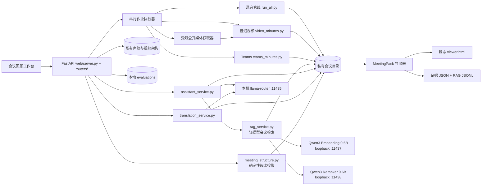

# 系统架构

## 目标与边界

本项目把本地录音、普通录屏、Teams 录制和用户明确提交的公开媒体链接转换为可检索逐字稿、说话人信息、逻辑画面与证据化阅读文档。默认情况下，会议正文、录音、声纹和组织架构不离开本机。管理员也可显式配置局域网或获批云端模型端点；产品不会自行跨端点或把本地失败静默降级为云端调用。

不在当前范围内：多人账号、远程部署、公网访问、云端模型自动回退、跨会议全局语义搜索。

## 组件关系

## 模块化单体边界

Meeting 与 Media 不是两套项目。二者共用 **Media Analysis Core**：媒体固化、音轨、ASR、说话人、镜头/逻辑页、VL、evidence、来源契约和导出；其上使用两个 domain profile：Meeting 强调决定/待办/风险与人员身份，Media 强调论证/规格/作者观点与叙事作用。Web、MeetingPack Viewer 和 KB HTML/Markdown 是同一 canonical 资产的不同 projection。

`web/static/app.js` 已同时承担导入、库列表、作业、播放器、逐字稿、纪要、媒体来源与导出，约五千余行，继续新增跨域状态的回归成本已高于单文件收益。下一阶段保持无构建原生 JavaScript，先按 `import`、`library`、`jobs`、`player`、`transcript`、`minutes`、`media-source`、`export` 抽为 ES modules，并让 `app.js` 只负责启动和路由。拆分完成的判据是模块拥有明确输入/输出、无头 Viewer 与 smoke 行为不变，而不是追求文件数；当前不引入 React、微前端或复制 Meeting/Media 页面。

## 目录职责

仓库根目录 `VERSION` 是产品 SemVer 的单一真源，由 `bin/product_version.py` 验证并投影到 Web 健康端点与 MeetingPack 导出器。产品版本不与前端缓存构建号、Git commit 或 `meetingpack/v5` 等数据 schema 绑定；各自按用户交付、工程历史和兼容性边界独立变化。

| 目录 | 职责 | Git |
|---|---|---|
| `bin/` | ASR、分离、抽页、纪要、声纹等批处理脚本 | 跟踪 |
| `web/` | FastAPI 服务、无构建前端、隔离测试 | 跟踪 |
| `docs/`、`prompts/` | 架构、运维、模型与提示词规范 | 跟踪 |
| `recordings/` | 原始输入与上传 inbox | 永不跟踪 |
| `meetings/` | 每场会议的全部派生文件和本地历史版本 | 永不跟踪 |
| `speaker_bank/` | 声纹、人员、组织架构与参考材料 | 仅跟踪虚构模板 |
| `evaluations/` | 人工验收事件、claim 指纹和标签；不复制会议正文 | 永不跟踪 |
| `web/jobs/` | 本地作业状态 JSON | 仅跟踪 `.gitkeep` |

代码根固定为仓库目录；数据根默认与代码根相同，也可通过 `MEETING_DATA_ROOT` 指到独立磁盘或一次性测试目录。管线脚本始终来自代码根，会议、上传和声纹数据来自数据根。

## 数据流

### 公开媒体链接

`POST /api/import-url` 只把原始 URL 写入数据根下的私有 inbox 请求文件，作业记录仅保存来源 host。`media_url.py` 校验 scheme、凭据和初始 DNS/IP，拒绝本机/局域网地址，再通过受限 `yt-dlp` 下载单条非直播视频（默认最长 6 小时、最大 8 GiB、最高 1080p）。下载器日志完全丢弃，解析结果经 `meeting_core.source_info` 缩减为 `media-source/v1`；Cookie、请求头、临时下载 URL、本机路径和原始 metadata 字典都不得落入内容目录、API 或导出包。generic 直链含 query 时认为可能带签名，只保留标题等公开元数据，不导出 URL。

来源标题和 `content_type=media` 在语音草稿前写入，因此整个处理链从第一步就使用媒体 prompt。下载成功后的本地母版进入普通 `video_minutes.py`，下游不感知获取方式。`source_info` 是来源的 canonical 白名单，Web、Viewer 与 KB 分别投影；Viewer 静态打开不联网，只有用户点击“原视频”才离开本地页面。

### 录音

`run_all.py` 先把输入固化为会议目录内的 `audio.wav`，再并行执行 ASR 与说话人分离，随后合并轮次并调用文本模型生成纪要。`meeting_core.asr` 是与 Web、GPU 和具体供应商无关的 ASR 边界：默认 `NativeQwenProvider` 保留当前进程内本地路径；`OpenAITranscriptionProvider` 可显式连接本机、局域网或获批云端的兼容 `/audio/transcriptions`。后者必须返回 word timestamps 才能进入说话人对齐；能力缺失会显式失败。跨 provider 回退只有设置 `MEETING_ASR_FALLBACK_PROVIDER` 后才启用。

ASR 在加载音频前通过 `meeting_core.terminology` 构建 `meeting-asr-context/v1`：只包含本场标题、私有词表中人工确认的术语，以及至少在两场会议屏幕中重复出现的高置信候选，并以 2400 字符硬上限传给 provider。所选术语的 ID、状态、provider 和 context 哈希写入会议目录 `asr.context.json`，不复制历史逐字稿。单场候选、低置信候选和模型推断不会确定性替换转写正文；`--no-context` 可用于同一素材的 A/B 验证。兼容端点在 `MEETING_ASR_CONTEXT_MODE=auto` 下若明确拒绝 `prompt`，只在同一端点去掉 context 重试；`required` 保持硬失败，`off` 不发送。增强能力不触发未配置的远端回退。

完整 ASR 默认只运行一次。`meeting_core.transcript_review` 在第一遍完成后检查人工确认术语中的已知混淆写法，每场最多对 12 个短音频片段做第二次声学识别。只有二次结果包含标准术语且不再包含混淆写法时才自动替换原语言文字；其余项目写入 revision-bound `transcript.review.json` 等待核听。复核异常由 `safe_review_term_confusions` 隔离，保留第一遍逐字稿继续处理。后置 LLM、纪要或翻译都无权改写 canonical 原语言逐字稿。

ASR 与 pyannote 仍是两条独立时间轴：前者产生文字/字级时间戳，后者产生说话人区间，`diarize.py` 最后按时间重叠归属文字。短段平滑不得再无条件吞掉所有亚秒说话人段：会议中已有稳定发言的声音簇，只要该区间存在 ASR 文字就保留单字插话；只出现一次的短标签至少需要两个可读字符；夹在同一说话人中间、无文字或仅孤立单字的新标签继续按抖动吸收。这个规则改善前后相继的短插话，不声称恢复两人真正同时说话时被单流 ASR 漏掉的第二路内容；后者需要多说话人 ASR 或源分离能力。

### 普通录屏

`video_minutes.py` 抽取音轨，并行执行 ASR/分离，待字级时间戳可用后再执行有文字依据的短段平滑，随后只为实际保留在逐字稿中的匿名声音簇入库（入库收尾时 ≤2 轮未绑定碎片声纹以 0.80 高阈值再匹配并入）。`diarize.coalesce_turns` 只合并相邻同人短轮次，并设约 45 秒/240 字上限；这既保留 canonical T ID 的真实时间分辨率，也避免单人口播被压成一个从 00:00 开始的超长 turn。存量会议可用 `repair_transcript.py` 仅凭现有字级时间戳与分离结果重建轮次，先写 `.versions/` 快照、按时间重叠继承已确认身份，不重跑 ASR 或全局声纹回填。逐字稿和说话人稳定后先用文本模型发布语音草稿；之后抽取逻辑页、进行 VL 页面理解（`describe_pages` 为有界并发，`MEETING_VL_WORKERS` 默认 2，需与 VL 服务 `--parallel` 槽位匹配；每页完成即原子落缓存，中断续跑语义不变），再用按页纪要原位替换草稿。

VL 终稿和 Topic Map 发布后，普通录屏与 Teams 管线会用一次本机文本调用从会议标题和 `page_desc.json` 提取术语候选。候选只写入私有 `speaker_bank/terminology.candidates.json`，保存不可逆的会议目录哈希而不是标题或路径；失败只记录异常类型，不改变正式纪要的 ready 状态。历史页面缓存可用 `bin/meeting_terminology.py backfill <meetings-root>` 回填，仍遵守“两场重复才可复用”的门槛。

### Teams 录制

`teams_minutes.py` 使用 Teams VTT 或 DOCX 的姓名线索与本地分离结果对齐；会议室混合通道继续按声纹拆分，然后进入同样的语音草稿 → VL 终稿流程。`teams_transcript.py` 是不依赖 Web 和第三方 Office 库的输入边界：VTT 读取 cue，DOCX 直接读取 OOXML 中“粗体姓名 → 时间码 → 正文”的 run 结构，忽略头像等媒体；DOCX 不含结束时间，因此用下一条开始时间推导，最后一条使用分离得到的媒体时长。解析失败在写 canonical 逐字稿前终止，不降级猜测姓名或正文。

说话人修正区分两类证据：未具名拆分或相似扩展需要音频 embedding；用户明确手选轮次并指定已有人员时，人工身份判断是更高优先级证据，服务端可直接复用该人员现有 voice。直接改派不改声纹质心、不写原始 cluster 映射，只更新选中 turn 的 `voice/speaker` 并写 `speaker.corrections.json` 硬锁；整个 bank、逐字稿和锁文件仍包含在 `speaker_history` 可撤销事务中。这样 0 时长/极短边界轮次不依赖模型可提取性，未选轮次也不会被隐式扩散。

外部逐字稿不是强制真源。上传路由通过 `transcript_policy` 明确选择 `external` / `ignored` / `local_asr`；`source.json.transcript_source` 记录当前 canonical 逐字稿来源。选择忽略时仍把 VTT/DOCX 固化为受保护母版，但 `speaker_navigation` 不得把其姓名标签投影到本地 ASR 结果。`retranscribe_local.py` 可为存量音频或视频会议创建 `.versions/before-local-asr-*` 快照，再使用当前显式配置的 provider 和最新 Context 重建逐字稿、说话人、纪要、evidence 和 Topic Map；视频复用 `slides.json/page_desc.json` 且不启动 VL，任一子管线失败时恢复快照。

音视频导入后通过 `meeting_dir.materialize_source` 固化到会议目录。优先创建独立 inode 的 CoW reflink，不支持时完整复制；`source.json` 的主媒体路径指向会议内文件。Web 对旧会议继续支持外部 `source.json` 回退，避免迁移前录音因缺少 `audio.wav` 而无法播放。

### 纪要证据与导出

`meeting_generation.py` 管理 `meeting-generation/v1` sidecar，只保存阶段、revision 和统计，不复制正文。阶段为 `voice_draft_generating → voice_draft → visual_enrichment → ready`。语音草稿请求显式关闭模型 thinking，避免输出预算全部落入隐藏 reasoning 而没有可读正文；失败时记录受控 `voice_draft_rc`，不阻断 VL 终稿，但前端必须明确显示“草稿失败，正在生成终稿”，不能把空纪要误报成草稿可读。语音草稿另存 `minutes.voice-draft.*` 作为可回溯快照；前端检测可读日志后立即打开，终稿 revision 变化时按同名标题尽量恢复阅读位置。草稿可播放、搜索、翻译和追问；服务端同时拒绝编辑应用、结论审计写入、Topic Map、重生成和 MeetingPack 导出。

文本模型协议由不依赖 Web 的 `meeting_core.llm` 统一处理，包括 loopback 边界、模型选择、thinking、超时和安全错误分类；`MEETING_LLM_MODEL` 是通用/助手模型，`MEETING_DRAFT_MODEL` 是视频早期草稿模型，`MEETING_MINUTES_MODEL` 是纯音频正式纪要与多模态终稿模型。当前默认让 35B MoE 负责尽快可读，让 Qwen3.8-27B dense 负责正式纪要；高质量恢复模型独立配置，不把 120B 加载成本施加到每场会议。`meeting_core.context_budget` 负责实际上下文窗口与保守 token 预算。`meeting_core.voice_draft` 在完整提示可容纳时直接生成；超限时按连续 T ID 轮次切成受预算约束的片段，先提取事实笔记，再合并为常规纪要。分段笔记是临时推导，不替代 canonical 逐字稿，最终 evidence 仍只能引用原始 T ID。后续 Topic Map、翻译和助手调用应逐步迁移到同一客户端，避免各自维护协议参数。

`minutes_by_page.py` 和 `summarize.py` 使用 `meeting-minutes-prompt/v1` 结构化输入，并在可读 Markdown 中留下隐藏的 T/P 证据 marker。`meeting_artifact.py` 将其规范化为 `minutes.evidence.json`；Web、`export_meeting.py` 和后续 RAG 都消费同一 sidecar。导出器生成 `meetingpack/v5`：顶层只有 `viewer.html + README.txt + AGENTS.md + assets/`。AGENTS.md 是给 AI agent 的一等使用合同：除文件地图与引用规则外，还按任务给出菜谱——单场深读、同系列多场对比（用 `sources.transcript` 里跨包恒定的 `person_id` 对人、topic-map 标题对议题、actions 按负责人+事项语义对待办，输出标注新增/延续/翻案/消失并引用双场 C 编号）、会后产出、知识库索引与事实核对——整包拖进 agent 会话时不只读纪要，也能直接做例行会对比。完整逐字稿、Topic Map、屏幕资料、媒体时间跳转、证据状态及已生成的双语纪要进入同一个无需服务、LLM、CDN 或网络请求的 Viewer。Viewer 只保留与在线工作台一致的“会议脉络 / 会议纪要 / 屏幕内容”，不再导出四种 audience/depth 重排视图。VL 描述在进入 evidence、Viewer 和 RAG 前复用在线端的 reasoning 清洗/标题提取。`assets/slides/pNNNN.jpg` 与 VL 原生分析帧共用同一份 JPEG：缓存存在时逐字节复用，缓存已清理时按同一页面时间点和分析参数从受保护视频母版恢复；不再为导出生成第二套 WebP。压缩分享媒体仍是独立派生副本，导出不会反写 canonical sidecar 或原始母版。`bin/export_pack.py` 在此基础上提供多内容打包：把 2–12 场会议各导出为 MeetingPack 后解压进 `meetings/<slug>/`，顶层叠加 README、AGENTS.md、`content-pack/v1` manifest 和 `content-pack-index/v1` 跨内容关键字贯穿线索索引（来源是实际打进包的关键字），Web 端 `GET /api/export/pack` 同步返回 `.contentpack.zip`。

`bin/kb_document.py` 是同一 canonical/evidence 数据的知识库投影，不把完整 MeetingPack 再塞进外部 RAG。`profile=kb` 生成轻量 Markdown 和在线媒体/图片深链；`profile=kb-html` 生成无脚本的单文件语义 HTML，并把 medium/high 关键画面在内存中重编码为最长边 1600px、quality 86 的 JPEG data URI。HTML 不引用本地文件、不需要静态资源目录；WeKnora 的静态 HTML→Markdown→base64 图片提取链可把它分成文本和可选图片资产。图片筛选与正文信息独立：被排除的低价值画面仍有标题、时间和 VL 文本，只有二进制不进包。两种投影只读会议目录，不调用模型，也不修改分析帧。

视觉语义的责任边界是“会议应用先分析，知识库按需补充”：`page_desc.json` 及其证据投影是主语义，外部 VLM 不属于 canonical 生成链。图文 HTML 即使在 WeKnora 关闭 VLM，仍可按随文标题、详情和时间深链完成文本检索；开启 VLM 只为补读尚未文字化的图像字段，结果属于知识库自己的派生 chunk，不能反写会议结论。这样避免每次入库重复调用视觉模型，也避免不同模型对同一图表产生竞争事实。完整规范见 `docs/EXPORT_AND_RAG.md`。

视频纪要存在一个明确的身份一致性栅栏：VL 可以与用户的说话人修正并行，但终稿文本不能消费 VL 前的旧逐字稿快照。`minutes_by_page.py` 在 VL 完成后重新载入 `transcript.spk.json`，以该 revision 生成上下文；发布前再次核对 revision。若文本阶段又发生身份修正，丢弃旧文本并复用 `page_desc.json` 重跑文本阶段一次，不重复 ASR、分离或 VL。

多模态终稿还经过一个非阻断覆盖审计。语音草稿 evidence 中的顶层决定、行动、风险和未决项会形成有上限的低信任 checklist，长会议 map 阶段只接收落在当前时间片的相关项；每一层都必须回到原始 T 证据核验，不能把 checklist 当新证据。发布后 `meeting_generation.coverage_audit` 以事项类型与稳定 T 交集判断它们是否在终稿保留或合并；文字相似但 T 不一致只记为诊断候选，不能冒充通过。审计不比较全文字数，也不把逐页页面事实算作“质量”。未匹配事项只在 `meeting.generation.json` 记录数量与 `review_needed`，不复制正文、不自动否决导出，因为后文纠正或合并也可能是合理原因。Web 将其显示为“终稿待复核”，引导用户进入结论审计。

阅读 API 与 Viewer 还消费一个不落盘的 `speaker_navigation` 投影：`verified_voice_binding` 表示声纹已绑定稳定人员；`imported_transcript_label` 表示 VTT/DOCX 明确姓名只在本场可靠；`session_voice_cluster` 表示未命名但已有 `voice_id`，可按本场声音簇跳播；`insufficient_voice_sample` 表示片段过短、没有可用声音簇，才禁止选择。该投影不反向修改声纹库，也不把本场标签/声音簇伪造成 `person_id`；旧导出包没有该字段时仅用匿名占位名启发式兼容。

多模态终稿的总体部分同样受 `ContextBudget` 约束。短会议直接生成；超限会议由 `meeting_core.minutes_overview` 按连续 T ID 切片，每段只携带关联 P 页面，再用人员语境和全页目录归并为总体摘要、行动、风险及 3–8 个议题板块。map/reduce 输出带退化防护：检测到自我修正循环或同一长句反复重述时，以 `repeat_penalty=1.2` 完整重试一次，仍退化则确定性清理（重复长行留首现、自我修正链整行删）后继续，不把循环垃圾写进 `minutes.md`；reduce 缺“总体摘要/待办事项”章节同样触发重试。待办章节另有合规校验：有表格行就必须逐行带 `kind=action`+`turns=` 证据标记，不合规先随防护重试，仍不合规按片段事实笔记定点重写该章节（`REPAIR_TODO_PROMPT`）并拼接回终稿。逐页讨论块继续按页面分组生成并独立控制输入规模。Web 重生成复用现有逐字稿、逻辑页和有效 VL 缓存，有源视频时只重抓缺页；成功后通过 `--publish` 更新 ready 状态并刷新 Topic Map。纪要 prompt 按 `meta.json` 的 `content_type` 分流（选择集中在 `minutes_profile()`）：media 内容换用论证结构 prompt 组（核心观点/规格与参数/论证脉络/质疑保留，不生成待办，map/reduce 与直出护栏同步切换必需章节并跳过待办修复），shot 镜头页的 VL 详解改用论证角色口径；会议口径不变。

若服务在 `visual_enrichment` 阶段中断，旧作业在重启时先标记失败；只要不存在同会议活动 writer，且 transcript/slides 仍完整，`regen_minutes` 可作为阶段级续跑入口，复用已完成的 VL cache，仅补缺页并发布终稿。其他草稿阶段仍拒绝重生成，避免 revision 竞态。

`stamps.json` 是 ASR 与字级对齐完整结束后的早期检查点，不在半截识别时发布。上传作业若在“语音转写”或“区分发言人”阶段失败，且受保护视频/音频和完整 stamps 仍存在，可通过 `speaker_resume` 恢复：`transcribe.py --reuse-stamps` 确定性重建 `transcript.ts.md`/`transcript.txt`，`video_minutes.py --reuse-asr` 随后重跑 pyannote 说话人分离、声纹与纪要等下游；不会重复 ASR，但当前仍需重跑说话人分离。任一必需资产缺失时拒绝伪续跑并要求重新导入。

### 媒体固化与存储生命周期

`meta.json` 只保存可读标题、内容类型与目录索引时间。`content_type` 取 `meeting`（默认）或 `media`：会议与媒体共用同一条管线、关键字索引和导出，只按该字段在列表与措辞上分流；缺字段或未知值一律按 `meeting` 读取，存量零迁移。`imported_at` 在首次上传成功后固定，`updated_at` 随改名、纪要/Topic Map/重转写成功更新。旧会议优先回放历史 upload job 的创建时间；无历史时才用最早派生资产 mtime 估算。源媒体 mtime 保留来源设备时间，绝不用作导入时间。

`meeting_dir.materialize_source()` 优先使用 Btrfs/兼容文件系统的 CoW reflink：会议母版拥有独立 inode，初始共享数据块，因此删除或原地修改下载源都不会影响项目文件，也不会立刻复制一份完整大文件；reflink 不可用时退回 `copy2`。浏览器上传先写项目 inbox，管线成功并确认母版已经固化后自动删除 inbox；失败或取消则保留，以便诊断和重试。音频导入同时保存 `source_audio.<ext>` 母版和可再生的 16k PCM 工作音轨。

`meeting-storage/v1` 把每场会议分为三类：原始母版（受保护）、阅读资产（逐字稿、纪要、证据、Topic Map、逻辑页面等）和可再生缓存（PCM 工作音轨、`full_*` VL 工作帧、`.rag` 索引）。`POST /storage/cleanup` 只删除代码白名单内且具备再生来源的缓存，并在会议仍有作业时拒绝执行；它永不删除母版或阅读资产。接口显示的是逻辑大小，CoW 共享块使实际物理释放量可能更低。当前清理由用户显式触发，自动保留期需在具备策略开关和磁盘压力提示后再启用。

### 人工结论审计

`evaluation_service.py` 将当前 evidence claim 与本机追加式审计事件合并。事件只落 claim ID、标签、备注和来源结构指纹；指纹在内存中覆盖结论及其引用的逐字稿/页面内容，但不把来源正文复制到评测文件。浏览器提交 claim 指纹作为乐观锁，服务端重新计算后才接受写入。相关来源发生变化时只让对应判断失效，审计动作不会修改 `minutes.md`。删除会议时同步删除该会议的审计文件。

### 原语言逐字稿人工修正

在线工作台通过 `transcript_service.py` 对 `transcript.spk.json` 做单轮、带乐观锁的文本修正，并同步重建 `transcript.spk.md`。每次写入前把逐字稿、复核 sidecar 和编辑历史复制到会议私有 `.versions/`，`transcript.edits.json` 记录前后 revision 和修正方法；用户可以精确撤销最近一次尚未被后续写入覆盖的修改。原始媒体、第一遍 `transcript.txt` 和外部 VTT/DOCX 母版不被覆盖。

人工修正会删除该会议的可再生 `.rag` 索引，并让 evidence、事实层、Topic Map 和翻译因 transcript revision 不一致而进入 stale/待同步状态；它不会用确定性代码伪造新的结论 linkage。用户明确执行“更新纪要”后，下游从修正后的 canonical 逐字稿重新生成。静态 MeetingPack Viewer 是不可写的分享副本；需要先在在线工作台修正和同步，再重新导出。

### 上下文感知翻译

`translation_service.py` 读取原始逐字稿，按目标语言分别生成 `transcript.translation.zh-CN.json` 和 `transcript.translation.en.json`。翻译按连续十轮分批，每批附带前后两轮、已确认人员名称、当前页面和直接关联的 evidence claims；系统提示将 conclusions 定义为低信任消歧材料，禁止补入当前发言未表达的事实。已经是目标语言的轮次由代码直接复用，其他语言及中英混合轮次调用与会议助手相同的本机 LLM，并整体整理成目标语言。批次顺序可在运行中由纪要依据和当前播放位置调整，但每批使用的原始语境不变。

会议脉络使用 `meeting.topic-map.translation.{target}.json` 保存结构化译文。模型只返回 `meeting_summary`、topic/child 的 `title` 与 `summary`；服务端按 ID 校验同构后，把 canonical 的节点 ID、类型、ranges、turn/claim/page IDs 覆盖回译文，避免语言切换破坏时间跳转或审计 linkage。sidecar 绑定 `meeting.topic-map.json` revision，旧译文不会跨版本展示。

同一服务按需生成 `minutes.translation.zh-CN.json` / `minutes.translation.en.json`。纪要按 Markdown 块切片；隐藏 evidence marker 在发送模型前替换为确定性 token，返回后逐一校验并恢复，因此译文继续指向同一组 claim/T/P 证据。sidecar 同时绑定 canonical 纪要 revision 和会议语境 revision，不覆盖 `minutes.md`；原文已经是目标语言时直接返回，不创建冗余文件。

屏幕阅读层使用 `visuals.translation.{target}.json`。`translation_service.py` 从 `page_desc.json` 投影稳定的 `{number,title,summary}`，每 12 页一批翻译并校验页号集合；完整 VL 正文不进入译文 sidecar。该 sidecar 绑定 `page_desc.json` revision，在线屏幕列表、Focus 舞台与 MeetingPack Viewer 复用同一阅读副本。

会议终稿 ready 后，`job_store` 在 upload/regen/topic_map 成功点懒调用 `auto_translate_after_ready()` 与 `auto_keywords_after_ready()`；旧会议在首次 bundle 请求时补触发。自动范围只有纪要、ready Topic Map、屏幕标题/短摘要和会议关键字，逐字稿仍需用户手动开始。翻译与关键字作业保持队列最低优先级，触发失败不会回滚已完成的主处理作业。

会议关键字由 `keyword_service.py` 生成 `meeting.keywords.json`（`meeting-keywords/v1`）：从事实层（缺失时退回当前 evidence claims）和一级议题标题中提取产品/项目/议题/组织名词，单次 JSON 调用；文本清洗、kind 白名单、12 条上限和 claim_ids 存在性都由代码校验，模型不接触的字段一律不落盘。sidecar 绑定纪要与事实层 revision，纪要从新生成后旧关键字按 stale 重建。关键字是导航与检索辅助，不参与 evidence marker 协议；在线会议列表/bundle、RAG 记录和 MeetingPack（`assets/keywords.json`）共用同一 sidecar。`keyword_service.py` 另提供纯读盘的全局索引（`keyword-index/v1`，NFKC + casefold + 去空白跨会议合并，单场坏数据跳过）与按共享关键字类别加权（product/project=3、organization/topic=2、other=1）的 `related()` 计分，分别服务 `GET /api/keywords/index` 和导出弹窗的 `/api/meetings/{slug}/keywords/related` 相关内容建议；索引请求时重建，不引入缓存。

sidecar 保存 T ID、源语言、译文、数字核对警告、逐字稿 revision 和会议语境 revision，不修改原始转写。翻译通过串行 Web 作业运行并逐批原子落盘；前端轮询部分 sidecar，只在完整轮次落盘后更新。取消、失败和服务重启保留已完成轮次并以显式 partial 状态续跑，不会产生一份伪装成完整结果的译文。当前为整场缓存与整场语境失效，后续如引入逐字稿局部修订，再细化为按 T ID 选择性重译。

### 在线阅读结构投影

`meeting_structure.py` 在请求 bundle 时读取现有纪要议题、`slides.json`、`page_desc.json`、逐字稿和 evidence，生成 `meeting-structure/v2`。它不调用模型、不写会议文件，只提供三个稳定对象：

- `Segment`：一个逻辑页面或摄像头画面的一次连续出现。同一页面的多个 range 必须展开成多个 Segment，避免返回旧页时所有跳转都落到第一次；
- `Chapter`：一个连续讨论时间段。优先解析纪要“议题板块”的开始时间，缺失时按视觉 Segment 降级；章节关联 T/P 来源，并确定性分组 discussion/decision/action/open claim；
- `Visual`：逻辑页面级资料，一页只保存一份完整 VL 描述和图片，同时列出全部出现 ranges、相关 Segment 与 claim。`display_status` 区分被讨论、仅展示和摄像头动态画面；`content_role` 与 `information_value=high|medium|low` 标记页面角色和信息价值。新 VL 输出显式给出这两个字段，旧缓存使用保守启发式；空白、过渡、会议 UI 等低信息 Segment 不再单独创建 fallback Chapter。

`information_value` 另有 `unknown` 状态：页面尚未处理、模型正文为空或 reasoning 清洗后无可靠答案时只能标“待解析”，不得用描述字数推断为低价值。只有 VL 明确给出 low，或页面说明明确命中空白、过渡、会议 UI 等语义时才能降为 low；简短但有效的旧说明默认保留为 medium。`describe_pages()` 在详细解读为空时改用短 JSON 视觉读取提取标题、页面类型和摘要，再确定性转成页面说明；两条路径都失败才保留 unknown，空正文不持久化为成功缓存。页面价值与 `display_status` 的讨论关联度始终是两条独立维度。

`meeting_topic_map.py` 在纪要生成完成后使用本机 LLM 建立 `meeting-topic-map/v3` sidecar（revision 匹配的 v1/v2 旧图仍可读取）。它先把逐字稿按约十五分钟窗口归纳为带稳定 `candidate_id` 的局部候选，再要求整场 reduce 用 `candidate_ids` 把每个候选恰好吸收到一个一级 Topic；3–8 个一级 Topic 和类型化子节点仍只保存经过校验的 T/P/C ID。v3 明确拆开两种含义：`topic.turn_ids` / `evidence_ranges` 是少量、可审计的代表论据，`topic.navigation_turn_ids` / `ranges` 是播放器聚焦范围，顶层 `navigation_segments` 则把整场逐轮标为 `topic`、`transition` 或 `unclassified`。导航是章节投影而非逐轮分类图：同一 Topic 前后夹住的不超过 60 秒短回应/过渡/未分类轮次归回该 Topic；不同 Topic 或长间隔不合并。Teams DOCX 重复时间戳在投影中按轮次顺序切成互斥范围，不改 canonical 时间。存量 v3 在读取时执行同一确定性收敛，无需重跑 LLM。这样 reduce 只返回代表轮次时不会丢掉局部候选覆盖，也不会为了“看起来全覆盖”把长段未知内容硬塞给错误议题；多个 Topic 的导航段保持互斥。`stats.coverage` / `turn_coverage` 表示归入业务议题的轮次比例，`time_coverage` 单列实际发言秒数比例，`navigation_coverage` 包含明确过渡段，另记录 `evidence_turn_coverage`、`transition_turns`、`unassigned_turns`、未映射/重复候选和恢复轮次数。所有 map/reduce 请求使用 OpenAI-compatible `response_format=json_object` grammar 强制 JSON 语法，并限制标题/摘要长度、禁止复制逐字稿；响应只经过 `clean_reasoning_text`，保留 JSON 的括号、转义和 Markdown fence，绝不能使用会拆 `\boxed{}`/独占花括号的 VL 人读清洗器。局部 map 和全局 reduce 返回不合法 JSON 时，只允许模型修复标点、引号与括号；修复仍失败时改用紧凑归并，再失败才确定性投影已通过局部归纳的候选。成功的局部窗口原子写入 checkpoint。sidecar 绑定逐字稿、纪要、页面和 VL revision，输入变化即标记 stale。

前端时间线用 Topic 的一个或多个 ranges 作为上层。会议内容继续用人物节奏条作为下层；媒体内容额外消费 Topic Map 的 `media_navigation`（schema `media-navigation/v1`）：确定性地按有效人物、主讲占比和轮次交替区分 `monologue/interview/hybrid`，并把已通过校验的子节点范围投影为铺垫、论点、展开、证据、演示、保留/风险和结论。单人口播显示议题+叙事，访谈显示议题+人物，混合内容显示三者；该投影不调用新模型、不修改逐字稿或身份，Web 与 Viewer 直接消费同一 sidecar。右侧“会议脉络”展示整场到一级议题再到类型化子节点的思维导图。通过质量门槛（`ready` 且 3–8 个一级议题）的 Topic Map 是 Web 与 MeetingPack 的默认首屏；首屏只画根节点与一级议题，选择某一分支后才展开其子节点。节点点击建立共享语义 Focus，但不改变播放时间；时间轴、逐字稿时间码和显式范围按钮负责 seek，并联动当前屏幕、逐字稿和结论高亮。Topic 和屏幕页面都只是 canonical evidence 的索引与重组；点击结论仍进入统一证据栏，VL 描述不能单独证明会议决定。Topic Map 缺失或不合格时回退正式纪要，不把视觉 Segment 扩写成几十个假章节。

Topic Map reduce 连续出现非 JSON 时依次尝试语法修复与紧凑归并；两者都失败后，`local-candidates-fallback/v3` 只把已通过局部窗口归纳的候选标题、摘要和 T/P/C 引用确定性组装并继续走 `_sanitize_map`。它不重新解释逐字稿、不伪造主题、不合并无关标题来伪造覆盖，也不绕过 Web/Viewer 的 3–8 主题质量门槛。前端轮询 upload/regen/topic-map 作业，当前会议的派生资产完成后自动重新读取 bundle，避免文件已经生成但页面仍停留旧空态。

`slide_pages.py` 的变化检测默认排除画面右侧 15% 的会议 UI/参会人栏，再计算时序活动掩码、页面相似度和代表帧。用于判页的低分辨率 RGB 帧会先抑制稀疏的高饱和红框/激光点；页面距离同时比较全页稳定内容和顶部 22% 标题区，所以同一表格的局部标注不切页，大标题改变仍切页。RGB 逐帧流式转灰度，不使整段三通道帧常驻内存。输出截图仍从原视频抓取完整画面；参数 `--ignore-right-pct 0` 可关闭右栏排除。对 `content_type=media` 的动态视频，`extract_pages(mode="media")`（管线经 `video_minutes.py --media` 触发）改用镜头原语：全帧差分局部显著峰切镜头（阈值 max(8.0, p50×6)，最短 1.5 秒并回邻居），每镜头取中点帧为代表帧，中位数签名合并重复出现的镜头，去重后超 80 页按总时长截断并在 `slides.json` 标注 `truncated`；输出结构与 slides 模式兼容（kind 仍为 `"slide"`，附加 `shot` 标记），会议录屏路径不变。

Web 与 MeetingPack 的常规纪要通过 `minutes_reading_markdown()` 从 canonical Markdown 做只读投影，在第一个“分页详情/逐页详情”章节前截断。投影层会从 claims 重新计算 `formal_action`，再重建“可核验待办”表：只有来自整场“待办事项/Action Items”章节、带有效逐字稿 T ID、且状态不是 informational 的行动项进入正式表格。语音草稿与多模态生成现在共用同一协议护栏：待办写“无”而其他章节出现非 informational action marker，视为漏投影并触发完整重试/待办定点修复；修复后待办章节之外的 action marker 确定性降为 discussion，保留事实和 T/P 引用但不形成第二套行动。逐页详情里的设备调试、到会确认、议程和汇报事实仍不得晋级。旧 sidecar 继续在读取时重投影。原模型待办表中没有绑定来源的行不会删除，而是进入 `action_candidates`，由在线端和离线 Viewer 默认收起并标为“待核实候选”。人读投影还会清理模型冗余输出的 `（T000001, ...）` 尾注；T ID 继续存在于隐藏 marker、evidence、RAG 和 transcript JSON，正文与证据抽屉只显示“依据 + 时间 + 说话人”。MeetingPack 的 `assets/minutes.md` 是同一常规阅读投影；完整库存另存为 `meeting.facts.json` / `assets/facts.json`，RAG 会同时摄入当前 claim 和被阅读投影省略的 fact。

所有模型文本进入阅读结构前统一剥离完整、残缺或反向出现的 `<think>/<analysis>` 块。新纪要/VL 生成同样在落盘前清洗；如果旧 VL 缓存清洗后没有可靠答案，页面标为需要重新解析，不把推理过程伪装成标题。

## Web 作业模型

- GPU/重模型管线统一进入单 worker `SerialPriorityExecutor`，避免互相争抢模型资源，同时允许尚未开始的任务重排。默认顺序为“用户置顶 > 新会议处理 > 纪要/脉络/组织图 > 逐字稿翻译”；同级保持提交顺序。普通“优先”只把等待项排到当前任务之后；“立即处理”只在当前 upload/regen 已进入后半程、canonical 逐字稿与 `slides.json` 均存在时开放。后者先验证 `minutes_by_page` 白名单续跑命令，再暂停当前进程组，把急件和自动续跑项依次置于用户优先队列。逐页 VL 结果原子落盘，因此续跑只补缺页，不重跑 ASR、说话人和已完成页面；语音转写、说话人分离、重转写及无页面检查点任务拒绝抢占。
- 每个外部管线运行在独立进程组，取消时先发 `SIGTERM`，5 秒后仍未退出则 `SIGKILL`。
- 作业 JSON 只保存状态和以 `[` 开头的元数据行，不保存任意 stderr 或会议正文。
- `/api/jobs` 返回实际 `queue_position` 与运行项的 `preemptible`；`POST /api/jobs/{id}/prioritize` 只接受 queued 作业，`POST /api/jobs/{id}/force-prioritize` 还要求当前进程仍存活且具备安全检查点。暂停源作业记录 `preempted_by/recovered_by`，自动续跑记录 `retry_of/auto_resume/resume_after`；续跑成功后才清理原 upload 暂存目录。取消 queued 作业会同时从内存等待队列移除。
- 服务重启时，遗留的 `queued/running` 作业会标为失败；系统不自动加载更大模型或盲目重放整条管线。`job-recovery/v1` 只依据安全作业元数据和资产存在性生成恢复计划：翻译、Topic Map、本地重转写，以及已形成逐字稿和所需页面缓存的纪要阶段可由用户显式续跑；早期导入失败要求重新导入。
- `POST /api/jobs/{id}/retry` 永不信任或直接执行旧作业 JSON 中的 `cmd`，而是从受控 builder 重新构造白名单脚本命令。新作业记录 `retry_of/recovery_attempt/recovery_quality`，旧作业记录 `recovered_by`；已有活动或成功 successor 时拒绝重复恢复。高质量恢复默认关闭，只能由部署者通过 `MEETING_RECOVERY_REFINE_MODEL` 显式开放。

## 会议助手

助手采用“模型提议、代码执行”的边界：

1. 浏览器提交逐字稿轮次索引与文档 revision，不提交任意文件路径。
2. `rag_service.py` 在当前会议内对 claim、逐字稿、VL 页面和纪要章节执行词法 + Qwen3 embedding 混合召回、RRF 融合与 Qwen3 reranker 重排；显式引用优先，claim/页面命中时按稳定 ID 补回原始逐字稿。
3. 问答调用本机 OpenAI-compatible API，返回可点击的统一 `R` 来源编号；检索可通过 `/api/meetings/{slug}/rag/search` 独立检查而不调用模型。回答以 SSE 流式返回：`POST /api/meetings/{slug}/assistant/chat/stream` 在流开始前同步完成校验与检索（revision 冲突仍返回 409），帧序为 meta（证据来源）→ delta（逐段正文）→ done；前端逐段渲染、完成后一次性重渲染接回引用链接。模型以 `finish_reason=length` 结束时服务端发送明确 error，不把半截正文伪装成成功；原非流式端点同样拒绝截断输出。
4. 局部修改时，模型只能选择候选 Markdown 章节并返回替换建议；整篇重组时只能从 `meeting-facts/v1` 白名单中选择、排序和组织，逐条保留原 marker。
5. `minutes.md` 始终是标准纪要 canonical。局部修改走原子替换与 `.history/minutes/` 备份；整篇重组经 `accept_minutes_view` 验收后只写 `minutes.views.json`（`meeting-minutes-views/v1`），绑定标准纪要与事实层 revision。旧客户端把整篇提案提交到局部写入接口会收到 409，不允许覆盖 canonical。
6. `minutes_view_service.py` 独立负责 AI 视图原子保存、数量上限和 revision 失效；bundle 只返回安全渲染 HTML 与必要来源，不向前端暴露 marker 协议正文。跨重启恢复从 `.history/minutes/` 选择最近的不同版本，恢复前先备份当前版本。
7. 服务端拒绝无依据正文、未知 marker、异常循环重复和正式待办语义升级，再生成结构化提案。Web 对明确修改命令自动选择“局部 apply”或“视图保存”；两条路径都会再次校验 revision，任何生成或校验失败都不会触碰 canonical 纪要。preview 响应同时包含由禁用原始 HTML 的 Markdown renderer 生成的 `after_html/before_html`，供结果卡阅读；原 marker 只保留在写入协议字段，不直接展示。
8. 局部纪要应用/撤销只刷新当前 evidence，不覆盖完整事实层；用户可撤销刚应用的修改，服务端只在当前 revision 仍与该提案一致时恢复历史版本，并留存撤销前副本。

默认只允许 `localhost/127.0.0.1/::1` 模型地址。远程模型必须在一次明确授权后设置 `MEETING_ALLOW_REMOTE_LLM=1`。
向量索引按会议持久化到私有 `.rag/`，manifest 不保存正文并与记录 revision 绑定；模型服务失败时自动降级为词法检索。当前仍是单会议检索，不是跨会议搜索。Web 和两个检索模型服务都只监听回环地址且没有多用户鉴权；在补齐 LAN/VPN 可达性、身份和会议权限之前，不得直接对同事网络开放。

## 人员身份、声纹与组织架构

声纹库 schema v3 将三层数据明确分开：

1. `person` 是稳定身份，保存独立首选显示名与已确认的类型化名称（Org Chart 原名、中文名、全拼、英文显示名和其他名称）。
2. `voice` 是可试听、可跨会议匹配的声音证据，多条 voice 可以绑定同一 person。
3. Org Chart 节点保存稳定节点 ID、可选 `person_id` 和 `manager_id`；岗位层级不再依赖姓名字符串作为主键。

声纹入库还区分“跨会议复用”与“本场聚类”。每轮入库先冻结进入会议前已经存在的候选，避免本场刚创建的
匿名 voice 立刻吞并后续相似聚类；未绑定 voice 在一场会议内最多认领一个 pyannote 原始聚类，已人工绑定
person 的 voice 才允许同场多簇，以兼容设备、距离或音色变化。voice 上可选的
`source_clusters: {meeting_slug: [raw_cluster_label]}` 保存幂等映射；恢复重跑先查该映射，旧数据发生同场
匿名多对一时在受控重跑中拆开。删除会议、移除声纹来源和碎片清理必须同时移除对应映射。该映射只是处理
主键，不代表人员身份，也不能把相似声音自动绑定到姓名。

姓名解析只允许唯一精确命中自动通过。包含与近似算法只产生候选，不得写入绑定；新人员必须显式创建。旧版 `leader` 姓名字段会在读取时兼容转换为节点关系，保存前验证缺失上级、自指和环路。Org Chart 提取结果是待确认草稿，不自动翻译、生成拼音、合并跨语言姓名或创建占位领导。

## 必须保持的工程约束

- 任何测试不得使用默认真实数据根或真实 `speaker_bank`。
- 前端传来的路径、会议 slug、引用索引和修改 proposal 都必须由服务端重新校验。
- LLM 输出不能直接成为文件操作、shell 命令或未确认的写入。
- 逐字稿 JSON 与 Markdown 的同步修改必须走同一个确定性函数。
- 姓名近似匹配不得直接产生人员绑定；Org Chart 草稿不得覆盖已确认汇报关系。
- 会议正文不得进入 Git、作业元数据日志或云端诊断上下文。

### 硬件适配层

`meeting_core.hardware` 统一解析设备、dtype 与模型路径。PyTorch 的 CUDA 和 ROCm
构建都通过 `torch.cuda` API 工作，但 doctor 将 backend 分别显示为 `cuda` 与 `rocm`；
支持 BF16 时使用 BF16，旧 NVIDIA 卡自动回退 FP16，CPU 使用 FP32。业务脚本不得继续
新增用户目录下的硬编码模型路径；ASR、aligner、pyannote、文本端点和 VL GGUF/mmproj
均通过 `MEETING_*` 环境变量覆盖。llama.cpp 可执行文件必须使用目标机器对应的 CUDA/HIP
backend 构建，完整部署约束见 `docs/DEPLOYMENT.md`。

## 目标工程演进

当前优先解决模块边界，而不是整体替换技术栈。`web/server.py` 与原生前端已承担会议、作业、身份、Org Chart、助手、翻译、验收和导出等多种状态；继续直接叠加跨会议知识、流式交互和版本浏览会增加耦合。

目标是先抽出不依赖 HTTP 的 `meeting_core`（artifact/revision、identity、retrieval、typed actions、Pydantic schema），再把 FastAPI 拆成版本化 `api/v1` routers 和用例 services。会议目录继续保存 canonical 正文/媒体；可新增 SQLite catalog 管理列表、作业、标签、UI 状态和未来 ACL，但不强制把私有逐字稿迁入数据库。

详情前端随后渐进迁移到 Vue 3 + TypeScript + Vite，保留现有 API 和 CSS token，用组件边界承接可调 panes、evidence drawer、流式助手、版本浏览和响应式布局。MeetingPack Viewer 继续单文件、无网络、无运行时依赖。Tauri 只在自动录制系统音频、托盘、安装包和原生权限成为产品主线时评估，不作为当前重构前提。完整依据与迁移顺序见 `docs/UX_REVIEW_AND_REFERENCES.md`。

## 未来的受控同事接入

计划形态是“同事提交会议文件 → 本机排队处理 → 本机发送或托管阅读页面 → 浏览器调用本机 LLM 追问”。这不是把当前 `127.0.0.1` 服务直接改成 `0.0.0.0`；后续网络入口必须位于模型和私有会议目录之外，并至少具备：

- 企业身份认证、会议级所有者/参与者 ACL，以及下载、导出、删除和对话权限；
- 上传配额、扩展名与媒体探测、隔离暂存、幂等任务 ID、失败重试和保留期；
- 队列的所有者、公平性和管理员插队审计，运行中任务继续不强制抢占；
- 浏览器只提交 meeting ID 和结构化引用，服务端重新校验路径与 evidence revision；
- LLM 仍只监听 loopback，由应用服务代理检索和推理，不能让浏览器直连模型端口；
- TLS/反向代理、CSRF/会话保护、速率限制和不包含会议正文的操作审计；
- canonical 会议资产、用户会话状态、作业目录和可再生缓存分层存储与生命周期策略。

本轮重构先让核心模块不依赖 FastAPI 或全局目录，并让作业/模型调用接受显式输入，为未来增加 `RequestContext(user_id, meeting_id, roles)` 和持久化 catalog 留边界；在身份、ACL 和审计完成前，服务仍只允许本机回环访问。
