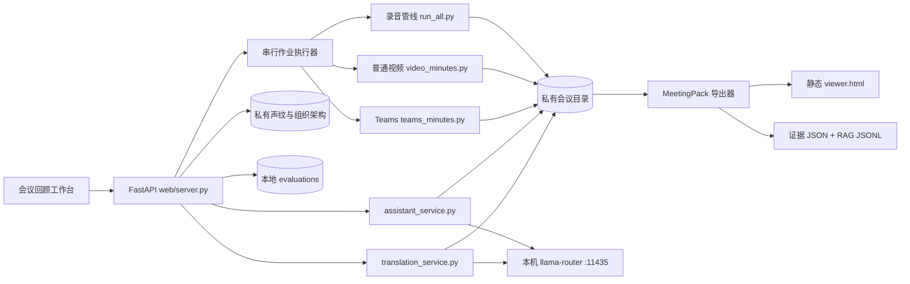

# 系统架构

## 目标与边界

本项目把本地录音、普通录屏和 Teams 录制转换为可检索逐字稿、说话人信息、幻灯片页和会议纪要。默认情况下，会议正文、录音、声纹和组织架构不离开本机。

不在当前范围内：多人账号、远程部署、公网访问、云端模型自动回退、跨会议全局语义搜索。

## 组件关系

## 目录职责

| 目录 | 职责 | Git |
|---|---|---|
| `bin/` | ASR、分离、抽页、纪要、声纹等批处理脚本 | 跟踪 |
| `web/` | FastAPI 服务、无构建前端、隔离测试 | 跟踪 |
| `docs/`、`prompts/` | 架构、运维、模型与提示词规范 | 跟踪 |
| `recordings/` | 原始输入与上传 inbox | 永不跟踪 |
| `meetings/` | 每场会议的全部派生文件和本地历史版本 | 永不跟踪 |
| `speaker_bank/` | 声纹、人员、组织架构与参考材料 | 仅跟踪虚构模板 |
| `evaluations/` | 人工验收事件、claim 指纹和标签；不复制会议正文 | 永不跟踪 |
| `web/jobs/` | 本地作业状态 JSON | 仅跟踪 `.gitkeep` |

代码根固定为仓库目录；数据根默认与代码根相同，也可通过 `MEETING_DATA_ROOT` 指到独立磁盘或一次性测试目录。管线脚本始终来自代码根，会议、上传和声纹数据来自数据根。

## 数据流

### 录音

`run_all.py` 先把输入固化为会议目录内的 `audio.wav`，再并行执行 ASR 与说话人分离，随后合并轮次并调用本机文本模型生成纪要。

### 普通录屏

`video_minutes.py` 抽取音轨，并行执行 ASR/分离，随后入库匿名声纹、抽取逻辑页、进行 VL 页面理解并生成按页纪要。

### Teams 录制

`teams_minutes.py` 使用 VTT 的姓名线索与本地分离结果对齐；会议室混合通道继续按声纹拆分，然后进入抽页和按页纪要流程。

音视频导入后通过 `meeting_dir.materialize_source` 固化到会议目录。同一文件系统优先创建硬链接，跨文件系统才复制；`source.json` 的主媒体路径指向会议内文件，同时保留 `original_*` 作为来源记录。Web 对旧会议继续支持外部 `source.json` 回退，避免迁移前录音因缺少 `audio.wav` 而无法播放。

### 纪要证据与导出

`minutes_by_page.py` 和 `summarize.py` 使用 `meeting-minutes-prompt/v1` 结构化输入，并在可读 Markdown 中留下隐藏的 T/P 证据 marker。`meeting_artifact.py` 将其规范化为 `minutes.evidence.json`；Web、`export_meeting.py` 和后续 RAG 都消费同一 sidecar。导出器生成 `.meetingpack.zip`，其中 `viewer.html` 不依赖服务、LLM、CDN 或网络请求。完整规范见 `docs/EXPORT_AND_RAG.md`。

### 人工质量验收

`evaluation_service.py` 将当前 evidence claim 与本机追加式验收事件合并。事件只落 claim ID、标签、备注和来源结构指纹；指纹在内存中覆盖结论及其引用的逐字稿/页面内容，但不把来源正文复制到评测文件。浏览器提交 claim 指纹作为乐观锁，服务端重新计算后才接受写入。相关来源发生变化时只让对应判断失效，验收动作不会修改 `minutes.md`。删除会议时同步删除该会议的验收文件。

### 上下文感知翻译

`translation_service.py` 读取原始逐字稿并生成会议目录内的 `transcript.translation.zh-CN.json`。翻译按连续十轮分批，每批附带前后两轮、已确认人员名称、当前页面和直接关联的 evidence claims；系统提示将 conclusions 定义为低信任消歧材料，禁止补入当前发言未表达的事实。中文轮次由代码直接复用，英文和中英混合轮次调用与会议助手相同的本机 LLM。

sidecar 保存 T ID、源语言、译文、数字核对警告、逐字稿 revision 和会议语境 revision，不修改原始转写。翻译通过串行 Web 作业运行并逐批原子落盘；取消、失败和服务重启不会产生一份伪装成完整结果的译文。当前为整场缓存与整场语境失效，后续如引入逐字稿局部修订，再细化为按 T ID 选择性重译。

## Web 作业模型

- GPU/重模型管线统一进入单 worker `ThreadPoolExecutor`，避免互相争抢模型资源。
- 每个外部管线运行在独立进程组，取消时先发 `SIGTERM`，5 秒后仍未退出则 `SIGKILL`。
- 作业 JSON 只保存状态和以 `[` 开头的元数据行，不保存任意 stderr 或会议正文。
- 服务重启时，遗留的 `queued/running` 作业会标为失败；当前不自动恢复。

## 会议助手

助手采用“模型提议、代码执行”的边界：

1. 浏览器提交逐字稿轮次索引与文档 revision，不提交任意文件路径。
2. 服务端从正式逐字稿解析引用，并补充相邻语境或执行轻量本地检索。
3. 问答调用本机 OpenAI-compatible API，返回可点击来源编号。
4. 修改纪要时，模型只能选择候选 Markdown 章节并返回替换建议。
5. 服务端生成结构化预览；用户确认后再次校验 revision，保存历史版本，再原子替换文件。
6. 用户可撤销刚应用的修改；服务端只在当前 revision 仍与该提案一致时恢复历史版本，并留存撤销前副本。

默认只允许 `localhost/127.0.0.1/::1` 模型地址。远程模型必须在一次明确授权后设置 `MEETING_ALLOW_REMOTE_LLM=1`。

## 人员身份、声纹与组织架构

声纹库 schema v3 将三层数据明确分开：

1. `person` 是稳定身份，保存独立首选显示名与已确认的类型化名称（Org Chart 原名、中文名、全拼、英文显示名和其他名称）。
2. `voice` 是可试听、可跨会议匹配的声音证据，多条 voice 可以绑定同一 person。
3. Org Chart 节点保存稳定节点 ID、可选 `person_id` 和 `manager_id`；岗位层级不再依赖姓名字符串作为主键。

姓名解析只允许唯一精确命中自动通过。包含与近似算法只产生候选，不得写入绑定；新人员必须显式创建。旧版 `leader` 姓名字段会在读取时兼容转换为节点关系，保存前验证缺失上级、自指和环路。Org Chart 提取结果是待确认草稿，不自动翻译、生成拼音、合并跨语言姓名或创建占位领导。

## 必须保持的工程约束

- 任何测试不得使用默认真实数据根或真实 `speaker_bank`。
- 前端传来的路径、会议 slug、引用索引和修改 proposal 都必须由服务端重新校验。
- LLM 输出不能直接成为文件操作、shell 命令或未确认的写入。
- 逐字稿 JSON 与 Markdown 的同步修改必须走同一个确定性函数。
- 姓名近似匹配不得直接产生人员绑定；Org Chart 草稿不得覆盖已确认汇报关系。
- 会议正文不得进入 Git、作业元数据日志或云端诊断上下文。
