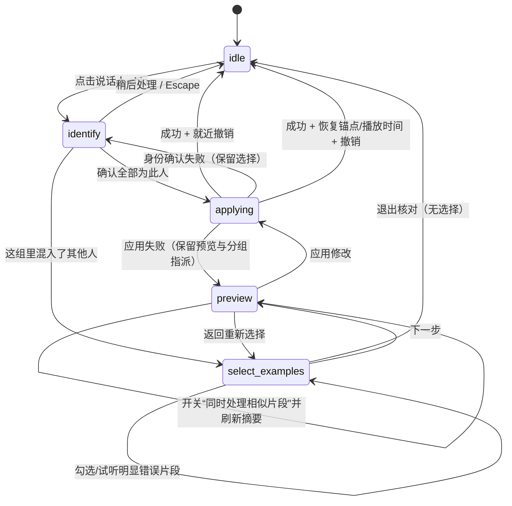

# 说话人身份确认与混声修复 UX

> 实施状态：v0.14.2 / Web p107 已实现；核心实现提交 `ac55ae9`。本文保留为交互状态和 DOM 合同。

状态：v0.14.2 已按本合同实施；后续调整仍需保持这里定义的状态、安全和 DOM 边界。

## 1. 当前痛点与成功标准

当前入口把“确认一个声音是谁”和“一个声音组里混入多个人”塞进同一阻塞弹窗，并把用户从
说话人 chip 突然带到底部全局标记条。用户被迫理解声纹、聚类、拆分和扩散，试听、预览、应用与
撤销又彼此分离。

本次只重做说话人确认与混声修复路径，不重构播放器、逐字稿、人员后台或 canonical 数据。成功标准：

- 普通身份确认最多三次点击；
- 高级修复只在用户主动指出“混入其他人”后出现；
- 默认只处理手选片段，系统建议必须主动开启；
- 应用前能看到多分组、段数、时长、代表片段、保护与存疑范围；
- 播放时间、逐字稿锚点和已选样例在预览失败后保留；
- 成功通知就近提供撤销。

停止条件：新流程完成完整 Headless Chromium 回归后停止，不顺带迁移播放器、人员后台或其他工作台
状态。旧 API/profile 可保留兼容，但旧交互入口不再可见。

## 2. UX 状态图



前端只保留一个显式状态对象：

```js
speakerCorrection: {
  mode: "idle" | "identify" | "select_examples" | "preview" | "applying",
  sourceVoice: null,
  sourceDisplayName: "",
  selectedTurnIndexes: new Set(),
  preview: null,
  includeSuggested: false,
  groupAssignments: {},
  returnScrollAnchor: null,
  returnPlaybackTime: null,
  exitConfirmation: false,
  error: ""
}
```

会议切换清空；API 失败只更新 `error`，不清空选择。退出复杂核对且已有选择时使用应用内确认区，
不用浏览器原生 `confirm()`。

## 3. DOM 结构

```text
#speaker-identity-popover              非阻塞；靠近 chip，窄屏进入底部 sheet
  header
    h3 “这个声音是谁？”
    button[aria-label="关闭"]
  .speaker-identity-summary            “42 段 · 18 分钟”
  .speaker-samples                     最多三个代表片段
    button “播放代表片段 …”
  .speaker-person-picker
    input[type=search]
    .speaker-person-candidates
    button “新建人员”
  .speaker-identity-error[aria-live]
  footer
    button.primary “确认全部为此人”
    button “这组里混入了其他人”
    button “稍后处理”

#speaker-correction-sheet              桌面右侧非阻塞 side sheet；移动端全宽 sheet
  header
    h3 “修复混入的说话人”
    p “选出几段明显不是「…」的发言即可”
    button[aria-label="退出人物核对"]
  .speaker-correction-body
    section[data-step="examples"]
      .selection-count[aria-live]
      .candidate-turn-list              仅来源组；时间、文本、播放、保护态、复选框
      .speaker-correction-error[aria-live]
    section[data-step="preview"]
      .preview-scope                    手选/建议/保护/存疑/预计分组
      label.switch “同时处理系统发现的高相似片段”
      .suggested-groups
        article.group-card              每组段数、时长、最多三段试听、人员选择
      .before-after-summary             修改前 / 修改后 / 保持不变
  footer.sticky-actions
    button.secondary                    退出核对 / 返回重新选择
    button.primary                      下一步 / 应用修改

#speaker-change-notice[role="status"]  就近非阻塞通知
  span “已将 6 段发言从…调整为…”
  button “撤销”
```

`speaker-correction-view.js` 只渲染上述 DOM，接收显式 view model 与 callback；不调用 API、不读全局
state、不控制播放器。`speaker-correction.js` 负责状态转换、preview 标准化、时长与前后摘要。`app.js`
只负责 API、播放、滚动锚、装配、刷新和撤销。

逐字稿 renderer 在 `select_examples` 模式只让来源组可选；其他轮次弱化且不可选。进入/退出不改变
`currentTime`，重渲染使用已有 scroll anchor。应用后仅高亮服务端返回的实际变更轮次。

所有用户可见文案由 `speaker-correction-view.js` 的中英 copy 投影生成；DOM renderer 必须接收显式
`language`，不能把中文写进状态值。每次改动都要在 Headless Chromium 中切换到英文，实际打开身份卡
和混声修复侧栏；“稍后处理 / Review later”是身份卡唯一的暂缓动作。

## 4. Preview 合同的最小扩展

现有 preview 的 `selected/suggested/protected/ambiguous` 索引继续保留，新增纯只读展示字段：

- `source_summary`: 段数、总时长、代表片段；
- `groups[]`: 稳定的临时 `group_key`、手选成员、建议成员、总时长、代表片段、建议人员、证据是否足够；
- `direct_only`: 片段过短、不能可靠寻找相似发言时为真；
- `result_summary`: 默认手选策略下的来源组/新组/保护/存疑计数与时长。

临时 group key 只用于一次 preview/apply，不写入 canonical。写入仍通过现有 revision 校验、`split`、
`bind`、speaker history 与 undo；人工确认轮次继续是硬保护区。若多组需要分别指定人员，apply 接收
`group_assignments` 并在同一 speaker transaction 中执行，避免前端逐组写入产生半完成状态。

## 5. “更多”与导出收束

会议头部直接保留“导出”；导出只展示两个用户目标：

1. **离线 Viewer**：给同事阅读、播放和回证；
2. **AI / 知识库 Pack**：给 GPT、豆包、Gemini、NotebookLM、WeKnora 或其他知识库继续使用。

旧的 `ai/kb/kb-html` profile 保持 API/CLI 兼容，不在普通弹窗平铺。WeKnora 的一键发布仍是独立旅程。

“更多”第一层只保留补充会议资料、重新处理、存储与高级设置；重新生成、重新转写、全文优化、内容
分类等放入“重新处理”应用内面板。说话人撤销的第一入口改为操作完成通知，菜单只保留第二入口。
